# BrewDay — Architecture & Codebase Overview

> **BrewDay** is a self-hosted, single-user web application that guides homebrewers through the entire brewing process — from recipe import to bottling — while collecting real measurements, sending notifications, and generating a brew day summary.

---

## Table of Contents

- [BrewDay — Architecture \& Codebase Overview](#brewday--architecture--codebase-overview)
  - [Table of Contents](#table-of-contents)
  - [1. High-Level Architecture](#1-high-level-architecture)
  - [2. Technology Stack](#2-technology-stack)
  - [3. Project Structure](#3-project-structure)
  - [4. Domain Model — The Brewing Process](#4-domain-model--the-brewing-process)
  - [5. Component Architecture](#5-component-architecture)
    - [5.1 Application Core (`internal/app`)](#51-application-core-internalapp)
    - [5.2 Configuration (`internal/config`)](#52-configuration-internalconfig)
    - [5.3 Recipe Domain (`internal/recipe`)](#53-recipe-domain-internalrecipe)
    - [5.4 Router Layer (`internal/routers`)](#54-router-layer-internalrouters)
    - [5.5 Storage Layer](#55-storage-layer)
    - [5.6 Notifications (`internal/notifications`)](#56-notifications-internalnotifications)
    - [5.7 Tools (`internal/tools`)](#57-tools-internaltools)
    - [5.8 Watcher (`internal/watcher`)](#58-watcher-internalwatcher)
    - [5.9 Frontend (`web/`)](#59-frontend-web)
  - [6. Data Flow](#6-data-flow)
  - [7. Deployment Architecture](#7-deployment-architecture)
  - [8. Design Patterns \& Principles](#8-design-patterns--principles)
  - [9. Database Schema](#9-database-schema)
  - [10. CI/CD](#10-cicd)
  - [11. Open Questions \& Improvement Areas](#11-open-questions--improvement-areas)
    - [Architecture](#architecture)
    - [Code Quality](#code-quality)
    - [Features](#features)

---

## 1. High-Level Architecture

BrewDay follows a **monolithic server-rendered** architecture. A single Go binary serves HTML pages, static assets, and API endpoints. All state is persisted in a SQLite database (or held in-memory for development).

```mermaid
graph TB
    subgraph Client
        Browser[Web Browser]
    end

    subgraph BrewDay Server
        Echo[Echo HTTP Server]
        Templates[HTML Templates<br/>go:embed]
        StaticFS[Static Assets<br/>CSS / JS]
        Routers[Phase Routers<br/>Mash · Lautern · Hopping<br/>Cooling · Fermentation<br/>Secondary · Summary]
        Timer[Timer System]
        Watcher[Watcher<br/>Scheduled Callbacks]
    end

    subgraph Persistence
        SQLite[(SQLite)]
        Memory[(In-Memory Store)]
    end

    subgraph External
        Gotify[Gotify Server<br/>Push Notifications]
    end

    Browser -->|HTTP| Echo
    Echo --> Templates
    Echo --> StaticFS
    Echo --> Routers
    Routers --> Timer
    Routers --> Watcher
    Routers -->|Read/Write| SQLite
    Routers -->|Read/Write| Memory
    Timer -->|Notify| Gotify
    Watcher -->|Notify| Gotify
```



---

## 2. Technology Stack

| Layer               | Technology                                                   |
| ------------------- | ------------------------------------------------------------ |
| Language            | Go 1.24                                                      |
| Web Framework       | [Echo v4](https://echo.labstack.com/)                        |
| Templating          | Go `html/template`                                           |
| CSS Framework       | Materialize CSS                                              |
| Database            | SQLite3 (`mattn/go-sqlite3`, CGO)                            |
| Database Migrations | [migrate](https://github.com/golang-migrate/migrate)         |
| Configuration       | [Koanf v2](https://github.com/knadh/koanf) (YAML + env vars) |
| Notifications       | [Gotify](https://gotify.net/) (self-hosted push server)      |
| Logging             | [zerolog](https://github.com/rs/zerolog)                     |
| Testing             | `testify`                                                    |
| CI/CD               | GitHub Actions                                               |
| Deployment          | Docker (amd64 + arm64)                                       |

---

## 3. Project Structure

```
brewday/
├── main.go                         # Entry point — config, DI, graceful shutdown
├── config.yaml                     # Default configuration
├── internal/
│   ├── app/                        # Application shell — Echo setup, route registration
│   │   ├── app.go                  #   Server init, component wiring, route registration
│   │   ├── handlers.go             #   Global handlers (timeline POST, error handler)
│   │   └── models.go               #   Top-level interface definitions
│   ├── config/                     # Configuration loading & validation
|   ├── db_migrations               # SQLite Migrations + Tests
│   ├── notifications/              # Gotify notification client
│   ├── recipe/                     # Core domain model
│   │   ├── recipe.go               #   Recipe, Malt, Hops, Yeast, status machine
│   │   ├── mmum/                   #   Maische Malz und Mehr JSON parser
│   │   └── braureka_json/          #   Braureka JSON parser (MMUM variant)
│   ├── render/                     # html/template renderer (implements echo.Renderer)
│   ├── routers/                    # HTTP handlers organized by brewing phase
│   │   ├── common/                 #   Shared: Router interface, Timer, Errors
│   │   ├── import_recipe/          #   Recipe file upload & preview
│   │   ├── mash/                   #   Mashing: start, rasts, timers
│   │   ├── lautern/                #   Lautering: rest timer, notes
│   │   ├── hopping/                #   Boiling: volume measurement, hop additions, timers
│   │   ├── cooling/                #   Cooling: timer, temperature
│   │   ├── fermentation/           #   Primary fermentation: SG, yeast, notifications
│   │   ├── secondary_ferm/         #   Dry hopping, bottling, secondary fermentation
│   │   ├── recipes/                #   Recipe list, continue, delete, status routing
│   │   └── summary/                #   Download brew summary
│   ├── store/                      # Recipe + results persistence
│   │   ├── memory/                 #   In-memory (maps + mutexes)
│   │   └── sql/                    #   SQLite (prepared statements)
│   ├── summary/                    # Summary model & persistence
│   │   ├── summary.go              #   Summary data model
│   │   ├── memory/                 #   In-memory summary store
│   │   ├── sql/                    #   SQLite summary store
│   │   └── printer/markdown/       #   Markdown summary printer (go:embed template)
│   ├── timeline/                   # Timeline event persistence
│   │   ├── memory/                 #   In-memory timeline
│   │   └── sql/                    #   SQLite timeline
│   ├── tools/                      # Brewing calculations
│   │   ├── color.go                #   EBC → SRM → Hex conversion
│   │   ├── convert.go              #   SG ↔ Plato, EBC ↔ SRM
│   │   ├── sugar.go                #   Priming sugar & carbonation
│   │   ├── summary.go              #   Efficiency, evaporation, ABV
│   │   └── water.go                #   Dilution calculations
│   └── watcher/                    # Goroutine-based scheduled callback
├── web/
│   ├── static/css/                 # Materialize CSS + custom styles
│   ├── static/js/                  # Materialize JS
│   └── template/                   # ~30 HTML templates (one per page/step)
├── test/config/yaml/               # Config validation test fixtures
├── deployments/                    # docker-compose files (amd64 + arm)
└── .github/workflows/              # CI (test) + CD (Docker Hub publish)
```

---

## 4. Domain Model — The Brewing Process

BrewDay models the full brewing workflow as a **state machine**. Each recipe progresses through these statuses:


Each state transition is persisted via `UpdateStatus(id, status, params...)`, allowing the user to **close the app and resume** at the exact step they left off. The `recipes` router handles this resume logic by mapping `(status, params)` → redirect URL.

---

## 5. Component Architecture

### 5.1 Application Core (`internal/app`)

The `App` struct wires everything together:


- **Startup flow**: `main.go` loads config → opens DB → creates stores → builds `AppComponents` → calls `NewApp()` → `Initialize()` registers middleware, static files, templates, and routes → `Run()` starts the Echo server.
- **Shutdown**: Catches `SIGINT`/`SIGTERM`, calls `app.Stop(ctx)` with a 10s timeout.

### 5.2 Configuration (`internal/config`)

Configuration is loaded in priority order:
1. YAML file (if `--config` flag is provided)
2. Environment variables (prefix `BREWDAY_`, always loaded, overrides YAML)

Validated fields: port (required), notification credentials (if enabled), store type + path.

### 5.3 Recipe Domain (`internal/recipe`)

The `Recipe` struct is the central domain entity. It contains:
- **Metadata**: name, style, batch size, target SG, IBU, EBC
- **Instructions**: `MashInstructions`, `HopInstructions`, `FermentationInstructions`
- **Runtime state**: status (with mutex), results, SG measurements, priming sugar results

Two **parsers** convert external JSON formats into the internal `Recipe` model:
- `mmum.MMUMParser` — Maische Malz und Mehr (fields are numeric)
- `braureka_json.BraurekaJSONParser` — Braureka variant (many fields are strings instead of numbers)

Both parsers use `reflect` to iterate over numbered fields (Malt1..Malt7, Hop1..Hop7, etc.).

### 5.4 Router Layer (`internal/routers`)

Each brewing phase is encapsulated in its own router package. Every router:
- Implements `common.Router` (single method: `RegisterRoutes`)
- Defines its **own interface subset** for the stores it needs (Interface Segregation)
- Manages HTTP handlers for GET (render page) and POST (process form, redirect to next step)
- Delegates timer logic to the shared `common.Timer`

**Timer System** (`common.Timer`):
The timer provides a reusable mechanism for countdown timers across phases:
1. `HandleStartTimer` — Records start time, calculates end timestamp, returns JSON for the frontend
2. `HandleStopTimer` — Marks timer as stopped, adds timeline event, sends notification
3. `HandleRealDuration` — Computes actual elapsed time between start and stop
4. Uses `AddDate` / `AddBoolFlag` in the store for persistence across restarts

### 5.5 Storage Layer

Three parallel storage subsystems, each with memory and SQL implementations:


**RecipeStore** is the richest interface (~15 methods): CRUD for recipes, results, SG measurements, dates, bool flags, and sugar results.

**SQL stores** use:
- Prepared statements for hot-path queries
- JSON marshalling for nested structs (malts, hops, rasts) stored as TEXT columns
- Foreign keys with cascade delete

**SummaryStore** also handles statistics which are **independent** of recipe ID meaning any data (even from past recipes) can be put into the stats table/memory store. 

### 5.6 Notifications (`internal/notifications`)

The `GotifyNotifier` integrates with a self-hosted Gotify server:
1. On startup, authenticates with basic auth to check if a "brewday" app exists
2. Creates the app if missing, stores the app token
3. Sends push notifications with optional extras (markdown, click URL, image)

### 5.7 Tools (`internal/tools`)

Pure-function brewing calculations:
- **Conversions**: SG ↔ Plato, EBC ↔ SRM, EBC → Hex color
- **Efficiency**: Sudhausausbeute (brewery efficiency) from SG, volume, and malt weight
- **Evaporation**: Evaporation rate (%/hour) from pre/post boil volumes
- **Alcohol**: ABV using the Cutaia formula from OG and FG
- **Sugar**: Priming sugar amount (glucose/sucrose) for target carbonation using Henry's law
- **Water**: Dilution calculations for gravity and volume targets

### 5.8 Watcher (`internal/watcher`)

A lightweight goroutine-based scheduler:
- Accepts a target `time.Time` and a callback
- Spawns a goroutine that sleeps via `time.After` until the target time
- Supports cancellation via a stop channel
- Used for fermentation SG measurement reminders and secondary fermentation notifications
- **Persistence-aware**: On restart, the fermentation router reconstructs watchers from stored dates

### 5.9 Frontend (`web/`)

- **~30 HTML templates**, one per page/sub-step
- **Materialize CSS** for responsive layout (mobile-first)
- Embedded via `go:embed web` in `main.go`
- Template functions: `static` (asset paths), `reverse` (named routes), `truncateFloat`, `recipeStatus`, `urlEncode`
- Frontend timers communicate with the backend via JSON API endpoints (`/timer/` routes)

---

## 6. Data Flow


---

## 7. Deployment Architecture


- **Docker images**: Multi-stage builds (Go builder → distroless/debian-slim runtime)
- **Two variants**: `Dockerfile` (amd64, distroless) and `Dockerfile.arm` (arm64, debian-slim for CGO/SQLite compatibility)
- **docker-compose**: Deploys BrewDay + Gotify with shared network, SQLite volume, and env var configuration

---

## 8. Design Patterns & Principles

| Pattern                   | Where                             | Notes                                                     |
| ------------------------- | --------------------------------- | --------------------------------------------------------- |
| **Interface Segregation** | Every router's `models.go`        | Each consumer defines only the interface methods it needs |
| **Dependency Injection**  | `main.go` → `AppComponents`       | All stores, renderer, notifier injected at startup        |
| **Strategy**              | Store backends, parsers, printers | Swappable implementations behind interfaces               |
| **State Machine**         | `recipe.RecipeStatus`             | Tracks progress; enables resume after restart             |
| **Router/Handler**        | `internal/routers/*`              | Each phase is an isolated module with its own routes      |
| **Template Method**       | `common.Timer`                    | Reusable start/stop/duration logic shared across routers  |
| **Observer**              | `watcher.Watcher`                 | Time-based callbacks for async notifications              |
| **Embedded FS**           | `go:embed web`                    | Zero external file dependencies in the binary             |
| **Graceful Shutdown**     | `main.go`                         | Signal handling with context-based timeout                |

---

## 9. Database Schema

All tables use SQLite with `INTEGER PRIMARY KEY AUTOINCREMENT` and foreign keys with cascade delete.


**Note**: Nested domain objects (malts, hops, rasts, yeast, additional ingredients) are stored as JSON-serialized `TEXT` columns rather than normalized tables.

---

## 10. CI/CD


- **Tests**: Run on push to `main` (only when `.go` files change) and on PRs
- **Publish**: Triggered by git tags; builds and pushes both amd64 and arm64 images to Docker Hub

---

## 11. Open Questions & Improvement Areas

### Architecture
- **No authentication**: The app is designed for single-user, but there's no auth layer at all. Consider basic auth or session-based auth if exposed to a network.
- **No database migration versioning**: Tables are created with `IF NOT EXISTS` but there's no mechanism for schema evolution. A tool like `golang-migrate` or `goose` would help.
- **Watcher lifecycle**: Watchers are goroutines that only survive the process lifetime. On restart, the fermentation router reconstructs them from stored dates, but this logic is duplicated between primary and secondary fermentation.
- **Monolithic summary store**: The `summaries` table has 30+ columns. Consider normalizing or switching to a document-oriented approach for this data.

### Code Quality
- **Reflection-based parsing**: The MMUM and Braureka parsers use `reflect` to iterate over `Malt1..Malt7`, `Hop1..Hop7`, etc. This is fragile — a struct field rename silently breaks parsing. Consider a map-based or slice-based approach.
- **Duplicated interface definitions**: `RecipeStore`, `TimelineStore`, `SummaryStore`, and `Notifier` are redefined in nearly every router package. While this follows ISP, the duplication creates maintenance overhead. Consider shared "read-only" and "write-only" sub-interfaces.
- **Inconsistent nil handling**: Some store methods are nil-safe (`if r.TLStore != nil`), others are not. This should be standardized.
- **Sparse test coverage**: Unit tests exist for `recipe`, `config`, `tools`, `watcher`, `mmum`, `braureka_json`, and store packages, but routers (the bulk of the logic) have no tests. Consider integration tests with a test Echo instance.
- **Hardcoded values**: Lautern rest time (15 min), fermentation recommended days (8–10), secondary min days (5), cooling max timer (48h). These could be made configurable or pulled from the recipe.
- **Error handling in handlers**: Timeline and summary errors are logged but silently swallowed. This is intentional (don't block the user) but makes debugging harder.

### Features
- **Summary formats**: Only Markdown is supported. The architecture supports adding new printers (JSON, PDF, HTML) via the `SummaryPrinter` interface.
- **Recipe formats**: Only MMUM and Braureka JSON are supported. The `RecipeParser` interface makes it straightforward to add BeerXML, BeerJSON, etc.
- **Index on wrong table**: In `migrations.go`, `createBoolFlagsTable` creates its index on the `dates` table instead of `bool_flags` — this is a bug.
- **Secondary fermentation refactor**: Per the `MISSING` file, the dry hopping UX needs rethinking. The current flow is functional but unintuitive.
